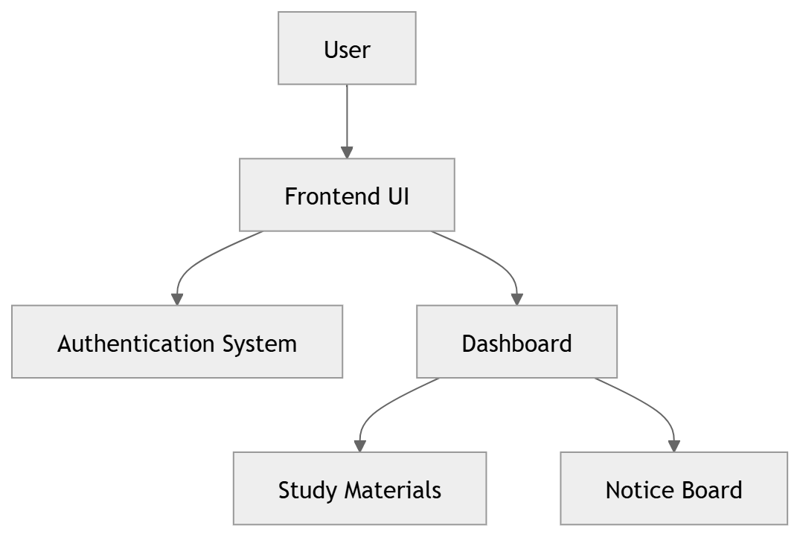

# 🎓 Student Management System

  
 
    

## 🚀 Live Demo:
### https://all-student-manegment-system.netlify.app/

## ✨ Features:

### 1.🔐 Authentication System
  1.Role-based login/signup (Student / Faculty) 
  2.Secure credential handling (UI level) 

### 2.📊 Student Dashboard
  1.Access study materials 
  2.View important notices 

### 3.👨‍🏫 Faculty Panel
  1.Upload materials 
  2.Manage notices 

### 4.🎨 Modern UI/UX
  1.Gradient design 
  2.Clean layout 
  3.Smooth navigation 

## 🖼️ Project Preview:

   
 
   

## ⚙️ Setup Instructions:

### 1.Clone the repository:
   git clone https://github.com/your-username/student-management-system.git

### 2.Go to project folder:
   cd student-management-system

### 3.Open in browser:
   index.html

## 📈 Future Enhancements:
🚀 Backend integration using Java (Spring Boot) 
🗄️ Database support (MySQL / MongoDB) 
🔐 JWT Authentication 
📱 Fully responsive mobile UI 
👨‍💼 Admin Dashboard 

## 💡 Project Objective:
   This project demonstrates how a Student Management System can streamline academic workflows by centralizing student data, study materials, and communication.

## 🧠 Architecture (Conceptual):

 

## 👨‍💻 Author:
   Debdut Nandy

## ⭐ Show Your Support:

  

